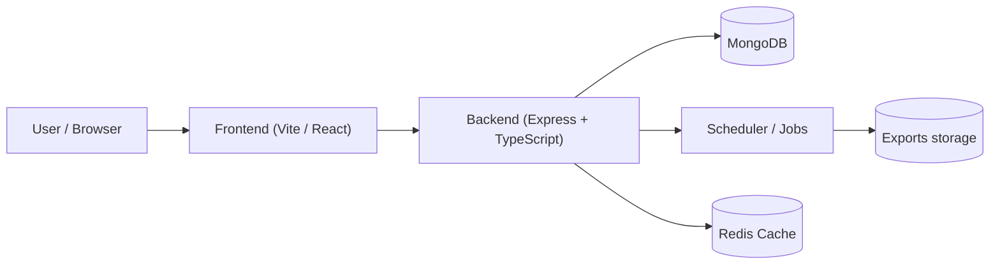

<!--
  Smart Leads Dashboard — Professional README
  Generated: May 17, 2026
-->

[](docker-compose.yml)
[]()
[]()

# Smart Leads Dashboard — Enterprise Lead Management

Premium, production-ready lead management platform for sales teams, designed
for scale, security, and fast evaluation. This repository contains a
TypeScript React frontend and an Express + MongoDB backend, fully
Dockerized for local development and production deployments.

---

## Table of Contents

- [Project Overview](#project-overview)
- [Key Features](#key-features)
- [Tech Stack](#tech-stack)
- [UI / UX Highlights](#ui--ux-highlights)
- [System Architecture](#system-architecture)
- [Folder Structure](#folder-structure)
- [Authentication & RBAC](#authentication--rbac)
- [Environment Variables](#environment-variables)
- [Installation & Local Development](#installation--local-development)
- [Docker & Production](#docker--production)
- [API Documentation (selected endpoints)](#api-documentation-selected-endpoints)
- [Database Overview](#database-overview)
- [Security & Best Practices](#security--best-practices)
- [Performance & Scaling](#performance--scaling)
- [Deployment Guide](#deployment-guide)
- [Screenshots](#screenshots)
- [Future Improvements](#future-improvements)
- [Contributing](#contributing)
- [License](#license)
- [Author](#author)

---

## Project Overview

Smart Leads Dashboard is a focused SaaS-style application for managing inbound
and outbound sales leads. It provides a modern, responsive dashboard for
searching, filtering, exporting, and auditing lead data while enforcing
role-based access controls and secure authentication. The product is built for
evaluators, recruiters, and engineering reviewers to demonstrate production
grade architecture and deployment readiness.

Who it's for
- Sales operations teams
- Startups with small/medium sales teams
- Engineers evaluating a full-stack TypeScript production app

Why it exists
- Centralize lead data and workflows
- Replace fragile spreadsheet-driven processes
- Provide secure, auditable export/import workflows
- Showcase a full-stack, deployable example of a SaaS product

Value proposition
- Easy onboarding, immediate value for lead management, and an audit-ready
  export pipeline that supports scheduled exports and admin workflows.

---

## Key Features

- Authentication and Authorization
  - JWT access tokens + refresh token rotation
  - First registered account becomes the `ADMIN` account (see details below)
  - Role-based Access Control (Admin, User)
- Dashboard
  - Paginated, searchable lead list
  - Saved filters and personal views
  - Lead detail view with activity timeline and audit metadata
- Lead Management
  - CRUD for leads with validation
  - Bulk CSV import with validation and error reporting
  - CSV exports (ad-hoc & scheduled)
- Filters & Saved Queries
  - Multi-field filtering (status, source, owner, date ranges)
  - Save and re-use filters per user
- Analytics & Reporting
  - Basic analytics endpoints (conversion, source breakdown)
  - Caching-ready design for high-read workloads
- Scheduling & Background Jobs
  - Scheduler for recurring exports and notifications
  - Exports written to `server/exports/` (configurable)
- Admin Features
  - User management, audit logs, export management
- UI / UX
  - Responsive, mobile-optimized React app
  - Tailwind CSS with design tokens, accessible components
  - Subtle micro-interactions and animation for premium feel
- DevOps & Production-readiness
  - Docker + docker-compose for local and evaluation environments
  - Multi-stage Docker builds & small runtime images
  - CI-friendly build and test scripts

---

## Tech Stack

- Frontend: React 18, TypeScript, Vite, React Router, React Query, Tailwind CSS
- Backend: Node.js (>=18), TypeScript, Express, Mongoose (MongoDB ODM)
- Database: MongoDB (compatible with Atlas)
- Auth: JWT access & refresh tokens; bcrypt for password hashing
- Infrastructure: Docker, docker-compose; ready for Vercel / Render / Railway
- Testing: Jest, React Testing Library, supertest (server)
- Tooling: ESLint, Prettier, ts-node, nodemon (dev)

---

## UI / UX Highlights

- Clean, minimal dashboard focused on data density and readability
- Accessible components and keyboard navigation for table rows
- Mobile-first responsive layout with prioritized content patterns
- Animations: subtle transitions for row expansion, modals, and toasts
- Premium feel: consistent spacing, tokens, and a design system in
  `client/src/styles/tokens.css`

---

## System Architecture

Client and server communicate over a versioned REST API (`/api/v1`). The
backend handles authentication, business logic, data access, and scheduled
jobs. MongoDB stores leads, users, refresh tokens, saved filters, and
audits. Background jobs (scheduler) operate in the same container by default
but can be migrated into separate worker services for scale.

Mermaid architecture diagram (rendered on supported platforms):



---

## Folder Structure

Top-level layout (abridged):

```text
smart-leads-dashboard/
├─ client/                   # React UI (Vite + TypeScript)
│  ├─ src/
│  │  ├─ components/         # Reusable UI components
│  │  ├─ pages/              # Route pages (Leads, Dashboard, Auth)
│  │  └─ styles/             # Tailwind + tokens
├─ server/                   # Express backend (TypeScript)
│  ├─ src/
│  │  ├─ controllers/        # HTTP controllers
│  │  ├─ services/           # Business logic
│  │  ├─ repositories/       # Data access layer
│  │  ├─ models/             # Mongoose models
│  │  ├─ middlewares/        # Auth, validation, error handling
│  │  └─ jobs/               # Scheduled tasks and background jobs
├─ docker-compose.yml
├─ package.json
└─ README.md
```

See `client/` and `server/` for more details. Example entry points:
- Frontend: [client/src/main.tsx](client/src/main.tsx)
- Backend: [server/src/index.ts](server/src/index.ts)

---

## Authentication & Role-Based Access Control (RBAC)

Authentication is implemented using JWT access tokens and refresh tokens.
Passwords use `bcrypt` hashing with a secure salt.

- Access tokens: short-lived (default 15m), supplied in `Authorization: Bearer`.
- Refresh tokens: long-lived (default 7d) and stored in the database for
  revocation support.

Admin-first-login policy (IMPORTANT)
- The very first account that is registered in a fresh database is
  automatically granted the `ADMIN` role. This is intentional to allow easy
  bootstrap and admin setup during evaluation.
- All subsequent registered accounts receive the `USER` role by default.
- Admins have elevated privileges: manage users, trigger exports, view audit
  logs, and access admin-only endpoints.

Protected routes
- Backend middleware checks the access token and validates role-based
  permissions before permitting access to admin routes (e.g. `/admin/*`).

Client-side
- `client/src/layouts/MainLayout.tsx` and `RequireRole.tsx` enforce
  navigation-level access restrictions and hide UI elements where appropriate.

---

## Environment Variables

Two sets of environment variables: backend (`server/.env`) and frontend
(`client/.env`). Example values are included below.

Backend `.env.example`:

```env
# Server
PORT=5000
NODE_ENV=development

# MongoDB
MONGO_URI=mongodb://localhost:27017/smart_leads_dev

# JWT
JWT_ACCESS_TOKEN_SECRET=replace_with_secure_random_value
JWT_REFRESH_TOKEN_SECRET=replace_with_secure_random_value
JWT_ACCESS_TOKEN_EXPIRES=15m
JWT_REFRESH_TOKEN_EXPIRES=7d

# App
CLIENT_ORIGIN=http://localhost:3000
ENABLE_SCHEDULER=true
EXPORTS_DIR=./exports

# Optional (Redis / Email)
REDIS_URL=
EMAIL_HOST=
EMAIL_PORT=
EMAIL_USER=
EMAIL_PASSWORD=
EMAIL_FROM=no-reply@example.com
```

Frontend `.env.example` (Vite uses `VITE_` prefix):

```env
VITE_API_URL=http://localhost:5000/api/v1
VITE_APP_NAME=Smart Leads Dashboard
```

Environment variables table (backend):

| Variable | Purpose | Notes |
|---|---|---|
| `PORT` | HTTP server port | default `5000` |
| `MONGO_URI` | MongoDB connection string | required |
| `JWT_ACCESS_TOKEN_SECRET` | Access token signing secret | rotate in prod |
| `JWT_REFRESH_TOKEN_SECRET` | Refresh token signing secret | rotate in prod |
| `JWT_ACCESS_TOKEN_EXPIRES` | Access token TTL | e.g. `15m` |
| `JWT_REFRESH_TOKEN_EXPIRES` | Refresh token TTL | e.g. `7d` |
| `CLIENT_ORIGIN` | Allowed frontend origin | used by CORS |
| `ENABLE_SCHEDULER` | Enable scheduled jobs | `true`/`false` |
| `EXPORTS_DIR` | Local folder for generated exports | persist or move to S3 in prod |

---

## Installation & Local Development

Prerequisites
- Node.js 18+ and npm
- Docker & docker-compose (for containerized dev)
- MongoDB (local or Atlas) — or use the `docker-compose` stack

Clone and install

```bash
git clone <repo-url>
cd smart-leads-dashboard

# Install root dev scripts (optional)
npm install

# Install server and client
cd server && npm install
cd ../client && npm install
```

Start local development (backend + frontend)

Option A — Run with Docker (recommended for reviewers):

```bash
docker compose up --build
```

Option B — Run locally (recommended for development):

```bash
# Terminal A: backend
cd server
npm run dev

# Terminal B: frontend
cd client
npm run dev
```

Default ports
- Frontend: http://localhost:3000
- Backend: http://localhost:5000

Testing

```bash
# Server tests
cd server && npm test

# Client tests
cd client && npm test
```

Troubleshooting
- If hot-reload fails on Windows, delete `node_modules/.vite` caches or
  restart the dev server. For Metro-like watchers on Windows, ensure long
  paths are handled and antivirus is not locking files.

---

## Docker Setup

Files
- `client/Dockerfile` — multi-stage build for the frontend static assets
- `server/Dockerfile` — multi-stage Node build for production
- `docker-compose.yml` — brings up MongoDB, server, and client for local
  evaluation

Common commands

```bash
# Build images
docker compose build

# Start services detached
docker compose up -d

# View logs
docker compose logs -f

# Stop and remove
docker compose down --volumes
```

Production notes
- Replace local `EXPORTS_DIR` with an S3-compatible storage service for
  persistent exports in production.
- Use a managed MongoDB (Atlas) and store secrets in your platform's
  secrets manager.

---

## API Documentation (selected endpoints)

Base URL: `{{VITE_API_URL}}` or `http://localhost:5000/api/v1`

Auth

- Register

  - POST /auth/register
  - Body: `{ "email": "user@example.com", "password": "Pa$$w0rd" }`
  - Response: `{ "user": { "id": "...", "email": "...", "role": "USER" }, "accessToken": "..." }`

- Login

  - POST /auth/login
  - Body: `{ "email": "user@example.com", "password": "Pa$$w0rd" }`
  - Response: `{ "accessToken": "...", "refreshToken": "..." }`

- Refresh

  - POST /auth/refresh
  - Body: `{ "refreshToken": "..." }`
  - Response: `{ "accessToken": "..." }`

Leads (protected)

- List leads

  - GET /leads?page=1&limit=20&filters={...}
  - Headers: `Authorization: Bearer <accessToken>`
  - Response: `{ "data": [...], "total": 123, "page": 1 }`

- Get lead

  - GET /leads/:id

- Create lead

  - POST /leads
  - Body: `{ "firstName": "John", "lastName": "Doe", "email": "..." }`

- Bulk import

  - POST /leads/import (multipart/form-data CSV upload)
  - Admins can upload CSVs and review validation reports

Exports & Scheduler (admin)

- Trigger export
- GET /leads/export?format=csv&filterId=<id>
- GET /leads/exports — list saved exports
- GET /leads/exports/download/:filename — stream file download

Example cURL (list leads):

```bash
curl -s -H "Authorization: Bearer ${ACCESS_TOKEN}" \
  "http://localhost:5000/api/v1/leads?page=1&limit=20"
```

For full API surface, see the `server/src/controllers` folder and the
OpenAPI/Swagger endpoint if enabled in `server/src/app.ts`.

---

## Authentication Flow (detailed)

1. User submits credentials to `/auth/login`.
2. Server validates and returns short-lived access token and long-lived
   refresh token. The refresh token is stored in the DB with a link to the
   user for revocation.
3. Client stores access token in memory (not localStorage) and refresh token
   in an httpOnly cookie or secure storage depending on deployment.
4. When the access token expires, the client calls `/auth/refresh` to obtain
   a new access token; refresh token rotation is supported.
5. Logout removes/invalidates refresh tokens server-side.

Security notes
- Do not store access tokens in localStorage in production unless paired
  with secure refresh token practices and SameSite cookies.

---

## Database Overview

Collections (core)

- `users` — email, passwordHash, role, createdAt
- `leads` — lead fields (name, contact, source, owner, status, meta)
- `refreshTokens` — token, userId, expiresAt, createdAt
- `savedFilters` — userId, name, criteria
- `audits` — resource, action, userId, timestamp, detail

Indexes
- Indexes are applied to optimize common queries: `createdAt`, `status`,
  `owner`, and `source`. Add additional compound indexes when query patterns
  require them.

Scalability
- For heavy read traffic, add a cache layer (Redis). For background
  processing, move jobs into separate worker processes and use a job queue
  (BullMQ or RabbitMQ).

---

## Security & Best Practices

- Passwords hashed with `bcrypt` and a secure salt factor.
- JWT secrets must be strong random values; rotate periodically.
- CORS restricted to `CLIENT_ORIGIN`.
- Input validation using request validators to prevent injection attacks.
- Use HTTPS in production and appropriate HSTS headers.

---

## Performance & Optimization

- Frontend: code-splitting, lazy route loading, and small bundle sizes via
  Vite production builds.
- Backend: pagination, projection fields, and query indexes to minimize
  payload and CPU. Use MongoDB projections for list endpoints.
- Docker: multi-stage builds and `.dockerignore` to keep images slim.

---

## Deployment Guide

Vercel (frontend) + Render / Railway (backend) — quick path

- Frontend: Build `client` and deploy static assets to Vercel or a CDN.
- Backend: Deploy server to Render, Railway, or a container service; set
  `MONGO_URI` and secrets in the platform's secret manager.

**Live Deployments**

- Frontend: https://task-smart-leads-dashboard-client.vercel.app
- Backend: https://task-smart-leads-dashboard.onrender.com


Railway / Render notes
- Ensure environment variables are added to the project settings.
- Use managed MongoDB or connect to Atlas. For exports, configure a bucket
  or external storage instead of the local filesystem.

Docker-based production

1. Build multi-stage images for server and client.
2. Run services behind a reverse proxy (NGINX) and secure TLS.
3. Store exported files in S3 or object storage and configure lifecycle
   policies.

---

<!-- Screenshots removed -->

## Future Improvements (Roadmap)

- S3-backed export storage + signed download URLs
- Role management UI with invitation flow
- Per-user quotas, billing integration, and multi-tenancy
- Observability: Prometheus + Grafana dashboards; OpenTelemetry
- Background worker separation and queue-backed retries
- End-to-end encryption for sensitive fields

---

## Contributing

We welcome contributions. Follow these guidelines:

1. Fork the repository and create a feature branch: `feature/your-feature`.
2. Follow existing code style and run linting and tests locally.
3. Write meaningful commit messages and include tests for non-trivial work.
4. Open a Pull Request with a clear description and testing steps.

Developer commands

```bash
# Run all tests
npm run test

# Format code
npm run format

# Lint
npm run lint
```

---

## License

This repository is released under the MIT License. See the `LICENSE` file
for details.

---

## Author

Smart Leads Dashboard — created and maintained by the project contributors.
For evaluation or recruitment questions, please contact the repository
maintainer.

---

> README last updated: 2026-05-17
